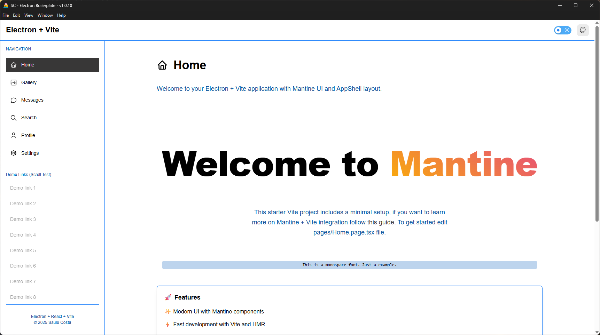

# Electron boilerplate

> Electron + Vite + React

---

<div align="center">
  
  
</div>

<div align="center">
  
  
  
  
  
  
  
</div>

---

<!-- Badge Start -->
<div align="center">
 
 
 
 
 
</div>
<!-- Badge End -->

---



---

## Help

- [Mantine](https://mantine.dev/)
- [Mantine Theme Editor - remoraid](https://remoraid.dev/)

## Getting Started

```bash
# Clone this repository
$ git clone https://github.com/saulotarsobc/sc-electron-boilerplate
# Go into the repository
$ cd sc-electron-boilerplate
# Install dependencies
$ bun install
# Run the app
$ bun run dev
```

---

## Available Scripts

```json
{
  "scripts": {
    "dev": "vite",
    "preview": "vite preview",
    "build": "tsc && vite build",
    "lint": "eslint . --ext .ts,.tsx",
    "postinstall": "electron-builder install-app-deps",
    "update-readme": "tsx scripts/update-readme.js",
    "generate-electron-builder": "tsx scripts/generate-electron-builder.ts",
    "dist": "bun run generate-electron-builder && bun run build && electron-builder"
  }
}
```

---

## References

- [Electron Builder](https://www.electron.build/)
- [ElectronJS with NextJS](https://github.com/saulotarsobc/electronjs-with-nextjs)
- [Electron](https://www.electronjs.org/)
- [Vite](https://vite.dev/)
- [Como criar um app Electron usando Vite](https://dev.to/rafaelberaldo/como-criar-um-app-electron-usando-vite-52d6) - [@rfberaldo](https://github.com/rfberaldo)
